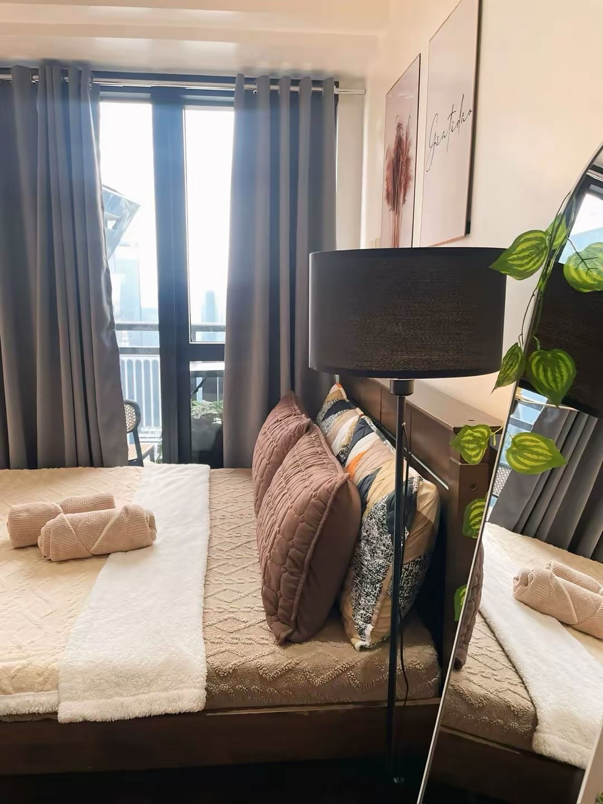
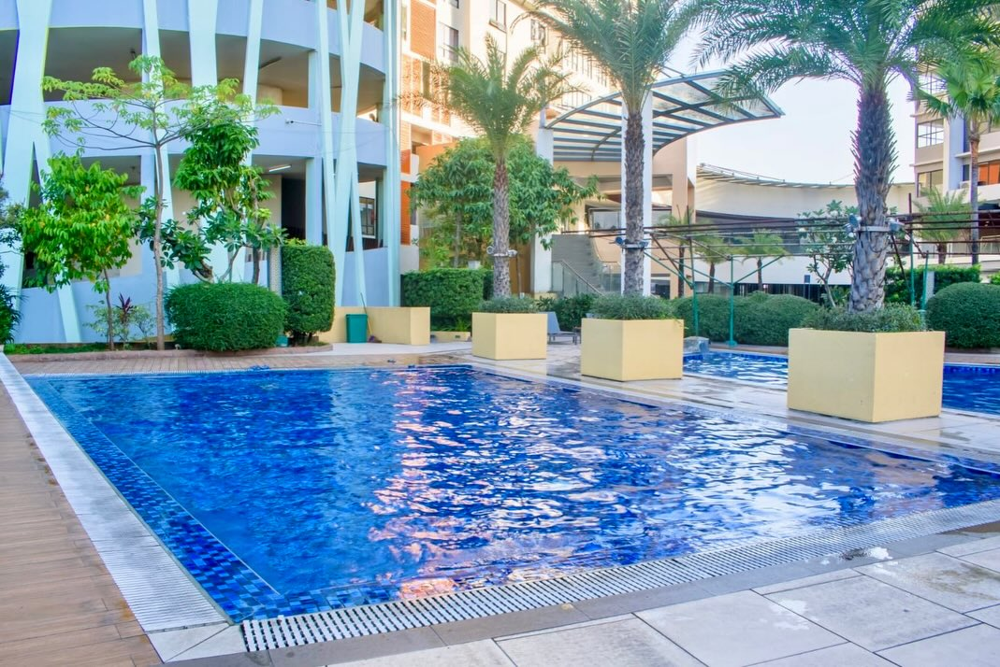
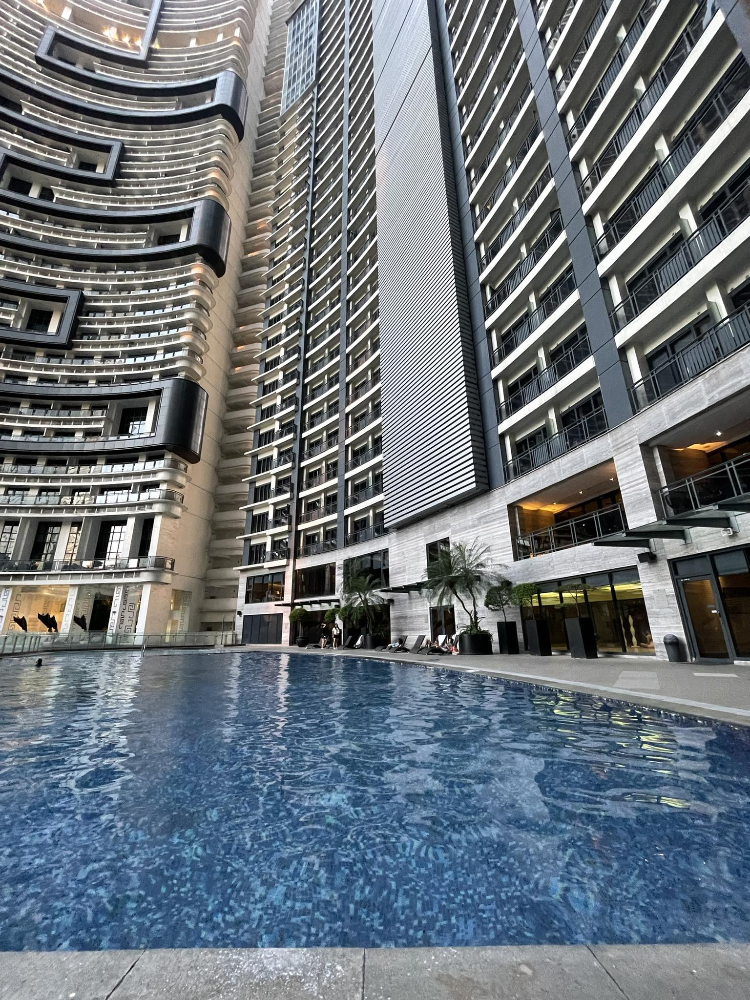

[Landing page.html](https://github.com/user-attachments/files/26764358/Landing.page.html)
<!DOCTYPE html>
<html lang="en">
<head>
  <meta charset="UTF-8">
  <title>Smart Staycation Finder</title>
  
</head>
<body>

  <header>
    <h1>Smart Staycation Finder</h1>
    
Find your perfect stay using our smart recommendations

  </header>

  

    

      <h2>Discover Your Perfect Stay</h2>
      <video autoplay muted loop playsinline controls>
        <source src="Promo vid.mp4" type="video/mp4">
      </video>
    

    

      

        
        <h3>Standard</h3>
        
₱1,500 / night

      

      

        
        <h3>Deluxe</h3>
        
₱3,500 / night

      

      

        
        <h3>Luxury</h3>
        
₱7,000 / night

      

    

    

      <h2>Find Your Perfect Stay</h2>

      <input type="number" id="budget" placeholder="Enter your budget (PHP)" min="1500">
      
Minimum amount is ₱1500

      <input type="number" id="guests" placeholder="Number of guests">

      <select id="type">
        <option value="">Choose a Place</option>
        <option value="makati">Makati</option>
        <option value="pasig">Pasig</option>
        <option value="antipolo">Antipolo</option>
      </select>

       
      <button onclick="recommendRoom()">Get Recommendation</button>
    

    

      <button onclick="bookNow()">Book Now</button>
    

  

  
💬

  

    
AI Assistant

    

      
<b>AI:</b> Hi! I can help you find a staycation 😊

      
<b>AI:</b> Try asking: "price" or "recommend"

    

    

      <input class="chat-input" id="chatInput" placeholder="Ask something...">
      <button class="chat-btn" onclick="sendMessage()">Send</button>
    

  

  

</body>
</html>
